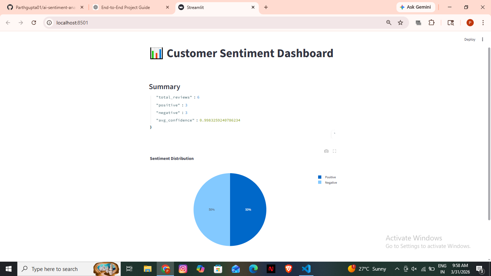

# 🚀 AI Customer Sentiment Analysis Platform

## 📌 Overview
This is a full-stack AI-powered application that analyzes customer reviews and provides sentiment insights in real-time.

---

## ⚙️ Features
- FastAPI backend for high-performance APIs
- PostgreSQL database integration
- AI-based sentiment analysis (HuggingFace)
- Background task processing
- Analytics API for insights
- Interactive Streamlit dashboard

---

## 🧠 Tech Stack
- Python
- FastAPI
- PostgreSQL
- SQLAlchemy
- Streamlit
- Plotly
- HuggingFace Transformers

---

## 📊 Dashboard Preview


---

## 🚀 How to Run

### 🔹 Backend
```bash
cd backend
venv\Scripts\activate
uvicorn main:app --reload